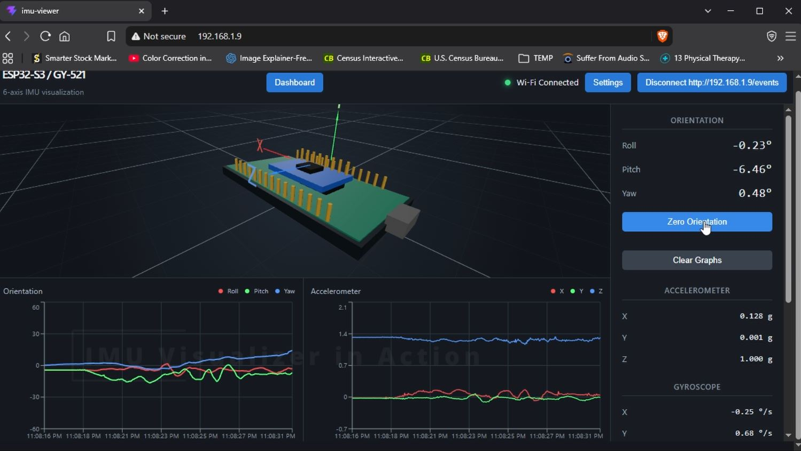
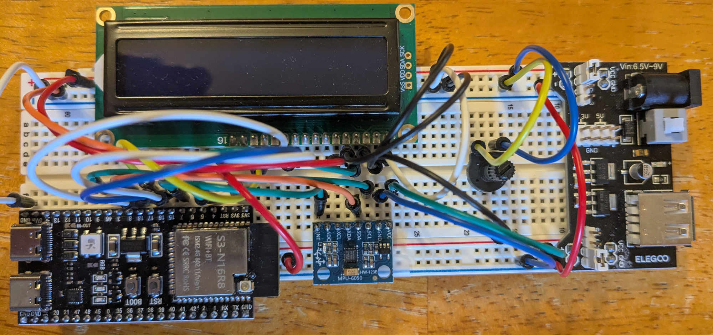

  

<h1 align="center">IMU Visualizer</h1>

  ESP32-S3 appliance sensor visualizing built with MicroPython

<!--
  <a href="">▶ Watch it in action</a> -->
  <a href="https://www.youtube.com/watch?v=4rmvpj-eMhI">▶ Watch it in action</a>

# ESP32-S3 / GY-521 6-Axis IMU Visualization

A MicroPython and React-based wireless IMU monitoring system built around an ESP32-S3 and GY-521 (MPU-6050) sensor module.

The ESP32-S3 runs the embedded application, manages the sensor acquisition loop, provides Wi-Fi connectivity, and hosts a web server that serves a React visualization application. The browser application displays live orientation, acceleration data, diagnostics, and a 3D representation of the device orientation.

## Features

- ESP32-S3 MicroPython firmware
  - Runs the main application loop.
  - Initializes and monitors the GY-521 IMU.
  - Performs sensor sampling and orientation calculations.
  - Runs the Wi-Fi and HTTP services.
  - Maintains hardware monitoring.

- Flexible Wi-Fi operation
  - Access Point mode.
  - Station mode joining an existing network.
  - Automatic mode selection with AP fallback.

- Embedded web server
  - Serves the React application directly from the ESP32 filesystem.
  - Provides REST-style configuration and status endpoints.
  - Provides Server-Sent Events (SSE) for live sensor streaming.

- React web application
  - Live 3D ESP32/GY-521 visualization.
  - Real-time orientation display.
  - Roll, pitch, and yaw graphs.
  - Accelerometer graphs.
  - Sensor diagnostics.
  - Orientation zeroing.
  - Wi-Fi and device settings interfaces.

## System Architecture

The system consists of three primary layers:

    +------------------------------------------------+
    |                React Web Application            |
    |                                                |
    |  3D View | Graphs | Diagnostics | Settings     |
    +--------------------------+---------------------+
                               |
                               | HTTP / SSE
                               |
    +--------------------------v---------------------+
    |              ESP32-S3 Web Server               |
    |                                                |
    |  Static Files | REST API | SSE Streaming       |
    +--------------------------+---------------------+
                               |
                               |
    +--------------------------v---------------------+
    |           MicroPython Application              |
    |                                                |
    | IMU Loop | Wi-Fi | LCD | Monitoring | Control  |
    +--------------------------+---------------------+
                               |
                               |
    +--------------------------v---------------------+
    |                 GY-521 MPU-6050                |
    |                                                |
    | Accelerometer + Gyroscope + Temperature       |
    +------------------------------------------------+

## Hardware

The project uses:

- ESP32-S3 development board.
- GY-521 module containing an MPU-6050 six-axis IMU.
- LCD1602 display module.
- I2C-connected peripherals.

The default I2C configuration in `main.py` is:

| Signal | GPIO |
| --- | ---: |
| SDA | 8 |
| SCL | 9 |
| IMU Interrupt | 7 |

## Pinouts Etc.

The pinout is slightly complicated by the LCD and potentiometer.  Since the power draw of the LCD is so high a regular USB power source to the ESP32 is insufficient.  I've attached the basic Elegoo "power module" to provide plenty of power for all components.

If you omit the LCD/potentiometer this can easily be powered by the USB-C port on the Esp32.

[Go here for pinout](https://github.com/rogerleuthner/public-imu-visualizer/blob/main/doc/Pinouts.txt)

  

## Firmware Overview

The MicroPython firmware entry point is `main.py`.

Responsibilities include:

- Starting the Wi-Fi subsystem.
- Starting the embedded HTTP server.
- Initializing the IMU.
- Handling IMU interrupts.
- Reading sensor data.
- Applying a complementary orientation filter.
- Generating sensor packets.
- Streaming data to connected clients.
- Reporting system statistics.

## Network Server

`imu_server.py` provides the network services used by the application.

### Supported Wi-Fi Modes

The server supports:

| Mode | Description |
| --- | --- |
| `AP` | Starts the ESP32 as a Wi-Fi access point. |
| `STA` | Connects to an existing Wi-Fi network. |
| `AUTO` | Starts AP mode first, attempts STA connection, and falls back when necessary. |

The configuration file is:

    /wifi_config.json

## HTTP API

The embedded server provides the following endpoints.

| Method | URL |
| -- | -- |
| GET | /api/status |
| GET | /api/config |
| POST | /api/config |
| GET | /events |

The server accepts JSON configuration updates and applies network changes when required.

## Sensor Processing

The firmware:

1. Reads accelerometer and gyroscope values from the MPU-6050.
2. Converts raw sensor readings into processed values.
3. Calculates accelerometer-based orientation.
4. Integrates gyroscope rotation.
5. Combines both using a complementary filter.

## React Application

The React application is the browser interface for the device.

Main capabilities:

- Three-dimensional device visualization using React Three Fiber.
- Live sensor charts.
- Orientation monitoring.
- Packet diagnostics.
- Connection management.
- Orientation zeroing.

The application communicates with the ESP32 through _Wi-Fi / SSE_.

## Data Flow

    MPU-6050
        |
        v
    MicroPython sensor loop
        |
        v
    Orientation calculation
        |
        v
    SSE event stream
        |
        v
    React state updates
        |
        v
    3D display and charts

## Embedded Web Server Design

The HTTP server is designed for constrained embedded operation.

Characteristics:

- Non-blocking sockets.
- Bounded network work per polling cycle.
- Single active HTTP client.
- Single SSE client.
- Chunked static file transmission.
- Protection against stalled clients.
- Limited buffering to prevent memory growth.

## Running the Device

1. Flash MicroPython onto the ESP32-S3.
2. Copy the firmware files to the device filesystem.
3. Build and deploy the React application files into the ESP32 web root.
4. Power on the ESP32-S3.
5. Connect to the configured Wi-Fi network.
6. Open the ESP32 web interface.

The default access point address configured by the server is:

    http://10.0.0.1/

Alternatively you can configure the device (_wifi_config.json_) to connect to a LAN with a static IP address.

## Development Notes

The firmware is designed around a continuous embedded control loop.

Important design goals:

- Keep sensor acquisition responsive.
- Avoid blocking network operations.
- Prevent network failures from stopping sensor monitoring.
- Keep memory usage predictable on MicroPython hardware.

## License

Copyright © 2026 Roger B. Leuthner. All rights reserved.

This software is provided for informational and educational purposes. Use of this software does not imply endorsement by the author of any particular use or application. The author assumes no responsibility or liability for any damages or consequences arising from its use.
